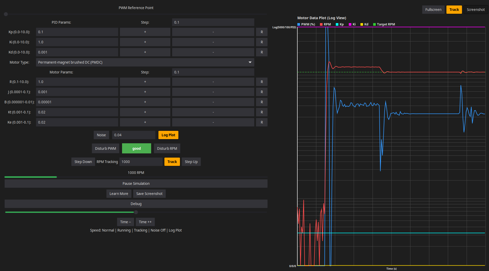
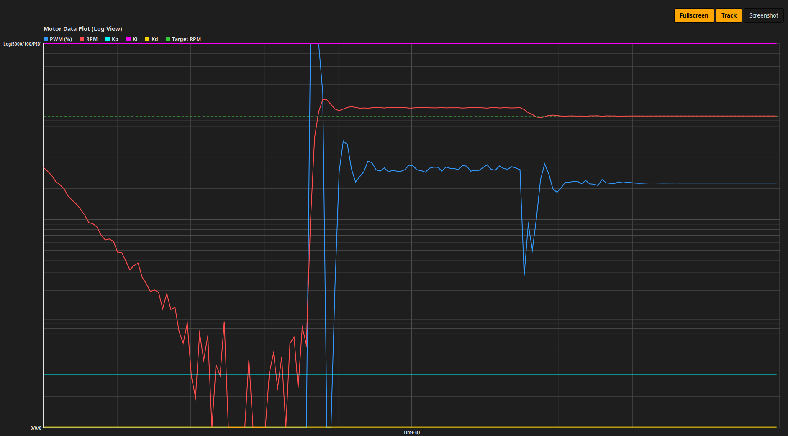

# dcmotor
A multi-threaded C++ application that simulates a DC motor with a PID controller, built using GTK4 and Cairo.
It features real-time plotting, adjustable motor dynamics, noise injection, and disturbance testing.

## Features

### Architecture
- Multi-threaded Design: Separate threads for GUI, Motor (PID), Plant (Physics), and Logger
- Blocking Queues: Thread-safe message passing between all components
- CSV Debug Logging: Toggleable console output with timestamped CSV format

### Motor Models
- Permanent-magnet brushed DC (PMDC)
- Coreless brushed DC
- Wound-field DC (fixed field current)
- Shunt DC (fixed field excitation)
- Compound DC (fixed field excitation)
- Dropdown selection instantly applies preset physical parameters (R, J, B, Kt, Ke)

### PID Controller
- Real-time Tuning: Adjust Kp, Ki, Kd on the fly with +, -, and R (reset) buttons
- Step Size Control: Configurable increment/decrement step values
- Detailed Tooltips: Each parameter and button explains its physical effect
- Derivative Filtering: Low-pass filter on derivative term to prevent noise amplification

### Motor Parameters
- Adjustable Physics: Resistance (R), Inertia (J), Friction (B), Torque constant (Kt), Back-EMF constant (Ke)
- Increment/Decrement Buttons: Fine-tune parameters with configurable step sizes
- Reset Capability: Return any parameter to its default value

### Real-Time Plotting
- Multi-Signal Graphs: Simultaneous display of PWM, RPM, Kp, Ki, and Kd
- Linear and Logarithmic Views: Toggle between linear and log scale Y-axis
- Theme Awareness: Automatically adapts colors for dark/light system themes
- Time Window Control: Expand (Time ++) or compress (Time --) the visible time range
- RPM Tracking Overlay: Dotted lime line showing target RPM when tracking is enabled
- Dynamic Y-Axis Labels: Right-justified labels that prevent truncation at any window size
- Grid Lines: Adaptive grid for both linear and logarithmic modes

### Disturbance Testing
- PWM Disturbance: Inject a 5% PWM pulse to test controller response
- RPM Disturbance: Apply a load torque pulse to test disturbance rejection
- Pulse Behavior: Disturbances auto-reset after 200ms for repeatable testing

### Noise Injection
- Gaussian Noise: Toggle motor output noise on/off
- Adjustable Amplitude: Control noise magnitude (0.001 to 1.0)
- Independent Thread: Noise generation runs in its own module

### RPM Tracking Mode
- Target RPM Input: Set desired RPM (0-5000)
- Step Up/Down Buttons: Adjust target by ±100 RPM increments
- PID Engagement: Controller automatically tracks target RPM when enabled
- Visual Feedback: Dotted target line appears on plot when tracking is active

### Simulation Control
- Pause/Resume: Halt the simulation without losing state
- Speed Adjustment: Three fixed speeds (Slow, Normal, Fast) with magnetic snapping slider
- State Indicator: Color-coded frame showing system status:
  - 🟢 Good: System is stable
  - 🟡 Warning: Error > 100 RPM
  - 🔴 Saturation: Error > 1000 RPM or PWM at limit

## Test
<br>
- with control panel and plot display
<div style="text-align: center;">
  
</div>

<br>
- with fullscreen plot only display
<div style="text-align: center;">
  
</div>

## User interface
- Fullscreen Mode: Hide control panel for maximum plot viewing area
- Screenshot Capture: Save a timestamped PNG of the entire window
- Status Bar: Real-time display of speed, pause state, tracking, noise, and plot mode
- Overlay Buttons: Quick access to Fullscreen, Track, and Screenshot directly on the plot
- Learn More: Direct link to PID controller Wikipedia page
- Tooltips: Comprehensive tooltips on every widget explaining its function

## State-space representation
- The application uses a classic closed-loop control system with summing junctions for commands, feedback, and disturbances.
```bash
[gui] ref      [motor] PID                    [motor] Σ               [plant] Plant
   |             |                              |                       |
   v  Σ err      v cmd = Kp*err + Ki*∫ + Kd*d   v pwm_in = cmd + dist   v rpm_true = f(pwm)
--->(-)-------->[PID]------------------------>(+)--------------------->[ ]----+
   ^                                              ^                      |
   |                                              | dist_cmd [gui]       |
   |                                              |                      v
   |                                              |                 [plant] Σ <---- dist_rpm [gui]
   |                                              |             rpm_loaded = rpm_true + dist_rpm
   |                                              |                      |
   |                                              |                      v
   |                                              |                 [plant] Σ <---- noise [noise]
   |                                              |             rpm_measured = rpm_loaded + noise
   |                                              |                      |
   |                                              |                      |
   +----------------------------------------------|----------------------+
                            feedback: - rpm_measured
```

## File Tree
```bash
doc/                      -- images inside
src/
├── main.cpp              -- Entry point, thread initialization
├── main.hpp              -- Central includes, aliases, constants
├── debug/
│   ├── logger.cpp        -- CSV logger thread, GTK warning filter
│   └── logger.hpp
├── gui/
│   ├── gui.cpp           -- GTK4 UI construction, event handlers
│   ├── gui.hpp
│   ├── plot.cpp          -- Cairo real-time plot rendering
│   ├── plot.hpp
│   ├── label.hpp         -- UI label string constants
│   └── tooltip.hpp       -- UI tooltip string constants
├── motor/
│   ├── motor.cpp         -- PID controller thread, voltage computation
│   └── motor.hpp
├── noise/
│   ├── noise.cpp         -- Gaussian noise generator
│   └── noise.hpp
└── plant/
    ├── plant.cpp         -- DC motor physics simulation thread
    └── plant.hpp
```

## Prerequisites
- xmake
- gtk4
- fmt

## Setup
- on ubuntu linux use **apt tool**
```markdown
# 1. Update package list
sudo apt update

# 2. Install essential build tools, GTK4, and fmt development libraries
sudo apt install -y build-essential pkg-config curl git libgtk-4-dev libfmt-dev

# 3. Install xmake (the build system used by this project)
curl -fsSL https://xmake.io/shget.text | bash

# 4. Source the bash profile to make xmake available immediately
source ~/.bashrc

# 5. Check xmake
xmake --version

# 6. Check GTK4
pkg-config --modversion gtk4

# 7. Check fmt
pkg-config --modversion fmt
```

- on windows use **MSYS2**
```markdown
# 1. Install msys2
https://www.msys2.org/

# 2. Run the installer and follow the default installation steps (install to C:\msys64).

# 3. Once installed, open the MSYS2 MINGW64 terminal from your Start menu (it must be the MINGW64 terminal, not the default MSYS2 terminal).

# 4. Update the package database and core system (press Y when prompted)
pacman -Syu

# 5. If the terminal closes during the update, reopen it and run:
pacman -Su

# 6. Install the MinGW-w64 toolchain, GTK4, fmt, and pkg-config
pacman -S --needed \
    mingw-w64-x86_64-gcc \
    mingw-w64-x86_64-pkg-config \
    mingw-w64-x86_64-gtk4 \
    mingw-w64-x86_64-fmt \
    git \
    python

# 7. Install Xmake
curl -fsSL https://xmake.io/shget.text | bash
source ~/.bashrc
```

## Build and Run
- on linux
```bash
run.sh
```

- on windows
```batch
run.bat
```

Copyright (c) 2026 alexander14k28@gmail.com

See [LICENSE](LICENSE) for the license governing this project.
